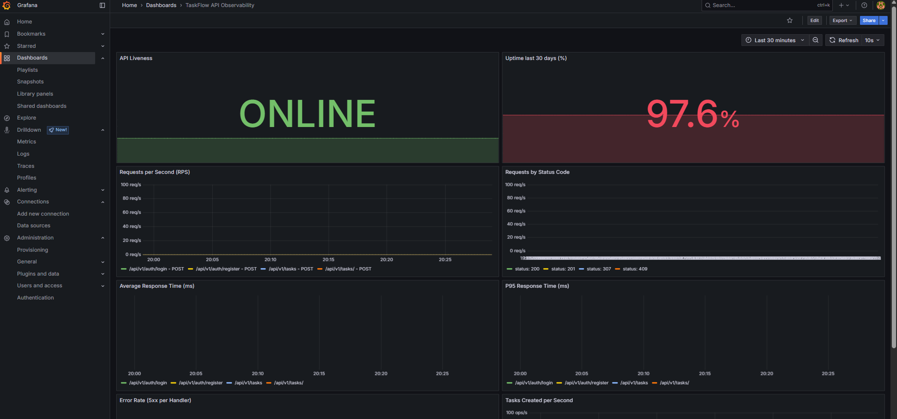
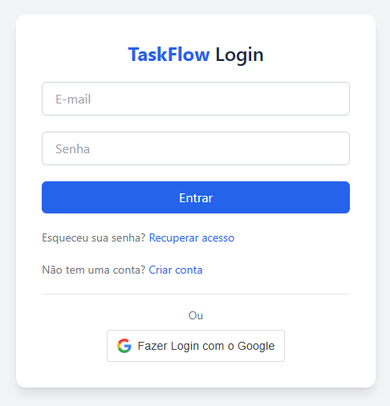
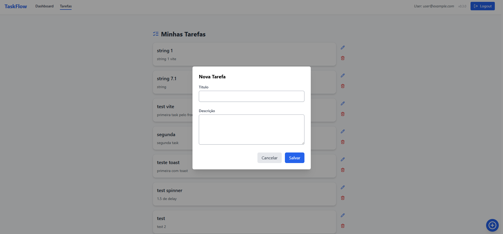

# TaskFlow

TaskFlow is a learning-oriented fullstack project built with **FastAPI**, **React**, **PostgreSQL**, **MongoDB**, **Celery**, **RabbitMQ**, **Prometheus**, **Grafana**, **Docker**, **GitHub Actions**, and **Render**.

This monorepo is designed to help developers explore how to build, test, observe, and deploy a modern web application from scratch using market-relevant technologies.

---

## 🌟 Objectives

Learn how to build and operate a complete modern web project, covering:

- 🔐 Authentication with JWT
- 📦 RESTful APIs (CRUD)
- 🧠 Relational database with PostgreSQL
- 📄 NoSQL storage for logs using MongoDB
- 🕒 Asynchronous processing with Celery + RabbitMQ
- 📈 Metrics exporting with Prometheus
- 📊 Observability with Grafana
- 🐳 Containerization with Docker
- ✅ Automated testing with Pytest
- 🧹 Linting with Flake8 and ESLint
- ⚙️ CI/CD with GitHub Actions
- 🚀 Deployment on Render
- 🎨 Frontend built with React + TypeScript + Tailwind

---

## 🧰 Technologies

### Backend

- [FastAPI](https://fastapi.tiangolo.com/)
- [PostgreSQL](https://www.postgresql.org/)
- [MongoDB](https://www.mongodb.com/)
- [Celery](https://docs.celeryq.dev/)
- [RabbitMQ](https://www.rabbitmq.com/)
- [SQLAlchemy + Alembic](https://www.sqlalchemy.org/)
- [Prometheus](https://prometheus.io/)
- [Grafana](https://grafana.com/)
- [Pytest](https://docs.pytest.org/)
- [Flake8](https://flake8.pycqa.org/)
- [Docker & Docker Compose](https://www.docker.com/)
- [Render](https://render.com/)

### Frontend

- [React](https://react.dev/)
- [Vite](https://vitejs.dev/)
- [TypeScript](https://www.typescriptlang.org/)
- [Tailwind CSS](https://tailwindcss.com/)
- [React Router](https://reactrouter.com/)
- [Axios](https://axios-http.com/)
- [ESLint](https://eslint.org/)

---

## 🚀 Running the project locally

### Prerequisites

- [Docker](https://www.docker.com/) + Docker Compose
- [Git](https://git-scm.com/)
- Python 3.11+ (optional, for local backend dev)
- Node.js 18+ (optional, for local frontend dev)

### Quick start

```bash
git clone https://github.com/douglasppa/taskflow.git
cd taskflow
cp .env.example .env
docker-compose -f docker-compose.dev.yml up -d --build
```

🧪 API available at: http://localhost:8000/docs
🎨 Frontend runs at: http://localhost:5173

## 🧪 Tests and Linting
Backend
```bash
docker-compose -f docker-compose.dev.yml exec web pytest
flake8 .
```
Frontend
```bash
cd frontend
npm run lint
```

## 🔁 CI/CD with GitHub Actions
GitHub Actions is used to:
* Run lint checks with Flake8 and ESLint
* Run backend unit tests with Pytest
Workflows are located in .github/workflows/.

## 🚢 Deployment on Render
This project is continuously deployed on Render.
* The backend uses the Dockerfile in /backend
* The startup command is:
```bash
python -m app.main
Make sure to set environment variables in Render’s dashboard based on .env.example.
```

## 🧭 Project Structure (Monorepo)
```bash
taskflow/
├── backend/       # FastAPI + Celery + Databases
├── frontend/      # React + Vite + Tailwind + TypeScript
├── grafana/       # Dashboards and provisioning
├── prometheus/    # Monitoring configuration
├── docker-compose.dev.yml
├── .env, .env.example
└── README.md, LICENSE, CHANGELOG.md
```

## 📊 Monitoring Dashboard
Here’s a snapshot of the current observability dashboard built with Grafana:


## 🖼️ Frontend Screenshots
Here are some screens from the React + Tailwind frontend built for TaskFlow:

### 🔐 Login


### 📋 Dashboard


### ✅ Task List


🤝 Contributions
This project is for personal learning, but contributions, ideas, and feedback are welcome! Open an issue or fork and submit a PR 🚀
